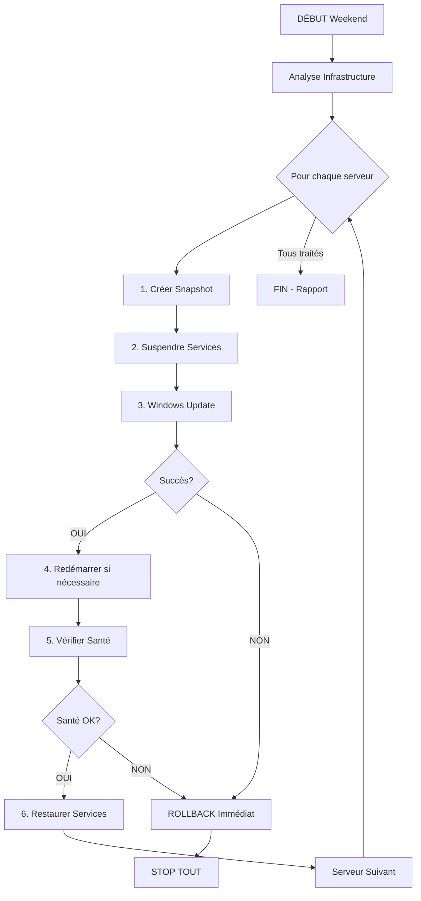

# 🎯 SYAGA Windows Update Orchestrator v3.0
## Synthèse Architecture & Stratégie

---

## 📊 VUE D'ENSEMBLE

### Infrastructure Type
```
┌─────────────────────────────────────────────────────────┐
│                    WORKGROUP                             │
│         (Pas de domaine AD sauf 1 client)               │
├─────────────────────────────────────────────────────────┤
│                                                          │
│  ┌──────────────┐     Réplication      ┌──────────────┐│
│  │ HYPER-V      │◄────────30 sec───────►│ HYPER-V      ││
│  │ HOST-01      │     Certificats       │ HOST-02      ││
│  └──────────────┘      Auto-signés      └──────────────┘│
│         │                                      │         │
│    ┌────┴────┐                            ┌────┴────┐   │
│    │  VMs    │                            │  VMs    │   │
│    └─────────┘                            └─────────┘   │
│                                                          │
│  ┌──────────────┐                                       │
│  │ VM VEEAM     │──────► Sauvegarde toutes les VMs      │
│  │ (Dédiée)     │                                       │
│  └──────────────┘                                       │
└─────────────────────────────────────────────────────────┘
```

---

## 🔄 WORKFLOW ORCHESTRATION

### Stratégie: **UN SERVEUR À LA FOIS**



---

## 📋 ORDRE DE PRIORITÉ

| Ordre | Type | Description | Criticité |
|-------|------|-------------|-----------|
| 1 | VMs Test/Dev | Environnements non-production | ⚪ Faible |
| 2 | VMs Non-critiques | Services secondaires | 🟢 Basse |
| 3 | VM Veeam | Sauvegarde (tolère interruption) | 🟡 Moyenne |
| 4 | VMs Services | Applications métier | 🟠 Élevée |
| 5 | DC Secondaire | Contrôleur domaine backup | 🔴 Critique |
| 6 | DC Primaire | Contrôleur domaine principal | 🔴 Critique |
| 7 | Hôte Hyper-V 02 | Serveur physique secondaire | ⚫ Maximum |
| 8 | Hôte Hyper-V 01 | Serveur physique principal | ⚫ Maximum |

---

## 🛡️ MÉCANISMES DE SÉCURITÉ

### 1. **Snapshots Systématiques**
- ✅ Avant CHAQUE update
- ⚠️ Nettoyage auto si manque d'espace
- 🔄 Rollback immédiat possible

### 2. **Suspension Services**
```powershell
# AVANT Update
├── Suspend-VMReplication    # Hyper-V
├── Suspend-VeeamJobs        # Veeam
└── Save-VMState             # État VMs

# APRÈS Update
├── Resume-VMReplication     # + Resync si nécessaire
├── Resume-VeeamJobs         # + Test backup
└── Test-VMHealth            # Vérification complète
```

### 3. **Rollback Automatique**
- 🔴 Au moindre échec → Rollback
- 🛑 Arrêt complet orchestration
- 📧 Notification immédiate

---

## 📊 MONITORING & NOTIFICATIONS

### Canaux de Communication
1. **📧 Email** (Prioritaire)
   - Chaque phase critique
   - Rapport détaillé HTML
   - Screenshots erreurs

2. **💬 Teams** 
   - Alertes temps réel
   - Statut progression
   - Erreurs critiques

### Points de Contrôle
```
✓ Ping serveur
✓ Services Windows critiques
✓ Services Hyper-V (vmms, vmcompute)
✓ Réplication santé
✓ Jobs Veeam état
✓ Espace disque > 5GB
✓ Applications métier
```

---

## ⏱️ TIMELINE TYPE

### Weekend Standard (10 serveurs)

| Heure | Samedi | Dimanche |
|-------|---------|----------|
| 00h | Début orchestration | Suite updates |
| 06h | 3-4 serveurs traités | 7-8 serveurs traités |
| 12h | Pause vérifications | Finalisation |
| 18h | 5-6 serveurs traités | Tests finaux |
| 23h | Rapport intermédiaire | **TERMINÉ** |

**Durée moyenne:** 45 min/serveur
**Buffer sécurité:** +50% temps

---

## 🚨 GESTION DES ÉCHECS

### Si Échec VM:
1. Restore snapshot Hyper-V
2. Redémarrer VM
3. Skip cette VM
4. Continuer autres serveurs

### Si Échec Hôte Hyper-V:
1. **CRITIQUE** - Basculement VMs sur réplicas
2. Notification urgente admin
3. Rollback manuel hôte
4. Arrêt orchestration

---

## 💾 COMMANDES PRINCIPALES

```powershell
# ANALYSE - Vérifier avant de commencer
.\ORCHESTRATOR-V3-SYAGA.ps1 -Mode Check

# PLAN - Générer plan détaillé
.\ORCHESTRATOR-V3-SYAGA.ps1 -Mode Plan

# EXECUTE - Lancer orchestration (weekend)
.\ORCHESTRATOR-V3-SYAGA.ps1 -Mode Execute

# MONITOR - Surveiller progression
.\ORCHESTRATOR-V3-SYAGA.ps1 -Mode Monitor

# ROLLBACK - Urgence manuelle
.\ORCHESTRATOR-V3-SYAGA.ps1 -Mode Rollback -Force
```

---

## ✅ GARANTIES

### Objectif: **ZÉRO PROBLÈME LUNDI MATIN**

- ✅ **Un serveur à la fois** = Risque minimal
- ✅ **Snapshots systématiques** = Retour arrière rapide  
- ✅ **Rollback automatique** = Pas de régression
- ✅ **Weekend complet** = Temps de résolution
- ✅ **Notifications temps réel** = Intervention possible
- ✅ **Vérifications exhaustives** = Validation complète

---

## 📈 MÉTRIQUES SUCCÈS

| Métrique | Cible | Mesure |
|----------|-------|---------|
| Taux succès | > 95% | Updates réussis/total |
| Temps moyen | < 45min | Par serveur |
| Rollbacks | < 5% | Minimiser interventions |
| Disponibilité | 100% | Services critiques lundi |
| Notifications | 100% | Toutes erreurs signalées |

---

## 🔐 SÉCURITÉ

- Authentification Azure AD App
- Certificats auto-signés Hyper-V
- Logs complets horodatés
- Rapport audit post-orchestration
- Snapshots chiffrés BitLocker

---

## 📞 CONTACTS

**En cas d'urgence pendant orchestration:**
- Email: sebastien.questier@syaga.fr
- Teams: Notification automatique
- Logs: C:\SYAGA-ORCHESTRATOR\Logs\

---

*Document généré le: $(Get-Date -Format 'dd/MM/yyyy HH:mm')*
*Version Orchestrator: 3.0*
*© SYAGA CONSULTING 2024*